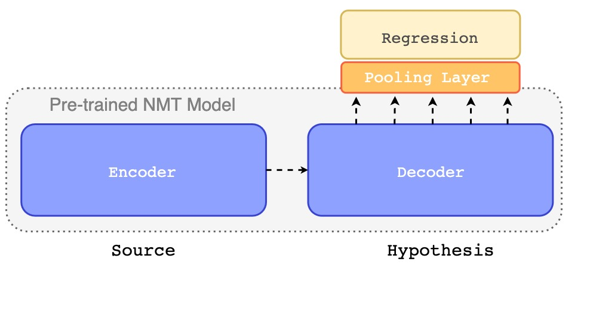

# WMT21 QE Shared Task

This repo contains the code used to develop a QE model on top on MBART.



### Installation:

```bash
pip install -r requirements.txt
pip install -e .
```

### Data:
Download the MLQE-PE data to the data folder:

```bash
cd data
wget https://unbabel-experimental-data-sets.s3.eu-west-1.amazonaws.com/wmt21/QE-task1-data.zip
unzip QE-task1-data.zip
```

### Training:

```bash
python cli.py train -f configs/mbart50-m2m.yaml
```

### Hyperparameter search_

```bash
python cli.py search -f configs/mbart50-m2m.yaml
```

### Testing:

```bash
python evaluate.py --checkpoint {path/to/checkpoint}.ckpt
```