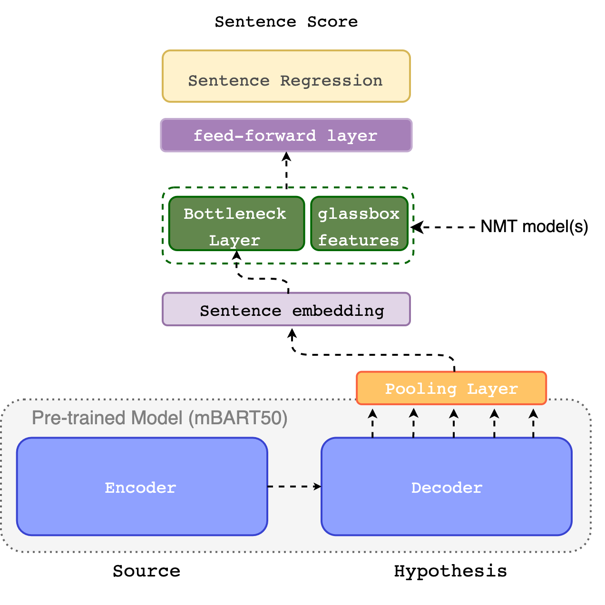

# WMT21 QE Shared Task

Code for the MBART QE Estimator (M2) from [IST-Unbabel 2021 Submission for the Quality Estimation Shared Task]()



For XLMR Estimators (M1) please take a look at [OpenKiwi](https://github.com/Unbabel/OpenKiwi)

## Citation:

```
@inproceedings{Zerva-etal-2021-ist,
	title        = {{IST-Unbabel 2021 Submission for the Quality Estimation Shared Task}},
	author       = {Zerva, Chrysoula  and van Stigt, Daan  and Rei, Ricardo  and C Farinha, Ana and Souza, José G. C. de and Glushkova, Taisiya and Vera, Miguel and Kepler, Fabio and Martins, André},
	year         = 2021,
	month        = nov,
	booktitle    = {Proceedings of the Sixth Conference on Machine Translation},
	publisher    = {Association for Computational Linguistics},
	address      = {Online},
}
```

### Installation:

```bash
pip install -r requirements.txt
pip install -e .
```

### Data:
Download the MLQE-PE with Glass-Box features:

```bash
cd data
wget https://unbabel-experimental-data-sets.s3.eu-west-1.amazonaws.com/wmt21/glassbox-MLQE-PE.tar.gz
tar -xf glassbox-MLQE-PE.tar.gz
```

**NOTE:**
If you use this data please cite the [original MLQE-PE corpus](https://github.com/sheffieldnlp/mlqe-pe)!

### Training:

```bash
python cli.py train -f configs/mbart50-m2m.yaml
```

### Hyperparameter search_

```bash
python cli.py search -f configs/mbart50-m2m.yaml
```

### Testing:

```bash
python evaluate.py --checkpoint {path/to/checkpoint}.ckpt
```